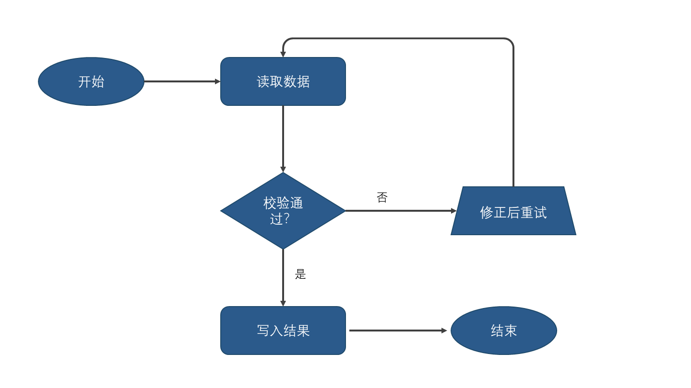
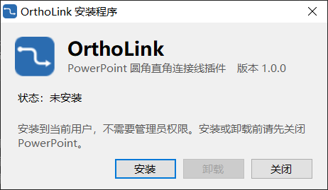

<p align="center">
  
</p>

<h1 align="center">OrthoLink</h1>

<p align="center">给 PowerPoint 加上 draw.io / Visio 那种圆角直角连接线。</p>

<p align="center">
  
</p>

## 为什么需要它

PowerPoint 自带的肘形连接线只有尖角，不能设圆角半径，端点只能吸在形状固定的几个连接点上。OrthoLink 生成的连接线：

- 拐角是真正的圆弧，半径可调。
- 端点可以落在任意形状的任意位置，梯形的斜边、椭圆的弧线也贴合。
- 移动形状后自动跟随，你手动调过的走线尽量保持不变。
- 保存后在任何 PowerPoint 里都正常显示，收件人不需要装插件。

## 功能一览

| | |
|---|---|
| 一键连接 | 选中两个形状，点"连接"，自动选择从哪边出、从哪边进 |
| 拖黄点改走线 | 每一段中间都有 PowerPoint 原生的黄色调节柄，拖动实时显示 |
| 自定义连接点 | 拖线的端点到形状任意一边上，松手吸附并记住位置；也可以在功能区里选左右上下 |
| 自动绕行 | 出入边和形状位置矛盾时（比如从左边出却要去右边），自动绕过去，最多五段 |
| 自动跟随 | 移动或缩放形状后线自动跟上，中间段留在原位 |
| 贴合真实轮廓 | 梯形、椭圆、菱形、自由曲线等异形形状，端点落在真正的边上 |
| 端点间距 | 线头可以离形状留出一段距离，每条线单独设，也有新线默认值 |
| 样式 | 圆角半径、端点间距、起止箭头可按线设置；颜色、粗细、虚线用 PowerPoint 自己的"形状格式" |
| 属性回显 | 选中线后功能区显示这条线的当前设置，改动直接作用于它 |

## 安装

要求：Windows 10 / 11，Microsoft 365 或 Office 2019 及以上。

1. 从 [Releases](../../releases) 下载 `OrthoLink-Setup-x.y.z.exe`。
2. 双击运行，点"安装"。安装到当前用户，不需要管理员权限。
3. 重新打开 PowerPoint，功能区出现 **OrthoLink** 选项卡。

<p align="center">
  
</p>

安装程序没有数字签名，Windows 可能弹出"已保护你的电脑"，点"更多信息"，再点"仍要运行"。

**卸载**：Windows 设置 → 应用 → 找到 OrthoLink → 卸载；或者再运行一次安装程序，点"卸载"。

**更新**：运行新版本的安装程序，点"更新"即可，会覆盖旧版本。

## 使用

<p align="center">
  
</p>

| 控件 | 作用 |
|---|---|
| 连接 | 先点起点形状，按住 Ctrl 再点终点形状，然后点这个按钮 |
| 重新布线 | 选中连接线后点击，清掉手动定的连接点，重新自动选边，中间段放回正中 |
| 更新本页 | 让本页所有连接线重新贴合两端形状。开着"自动跟随"时一般用不到 |
| 自动跟随 | 开启后移动形状线会自动跟上、拖线端点会自动吸附。关掉后改用"更新本页" |
| 选中的连接线 → 起点 / 终点 | 指定从哪条边出、从哪条边进。"自动"交给插件决定 |
| 选中的连接线 → 圆角 / 间距 | 只改当前选中的线。可以从列表选，也可以直接输入数字，单位 pt，0 表示直角或贴合 |
| 选中的连接线 → 起点箭头 / 终点箭头 | 选中线时改它，没选中时改新线默认值 |
| 新线默认值 → 圆角 / 间距 | 之后新建的线用这些值，不影响已有的线 |

**调整走线**：点选一条线，每一段中间出现黄色小点，拖动它平移那一段。

**改连接点**：点选一条线，拖它两端的小方块到目标形状的边上，松手就吸附。拖到另一个形状上就改连那个形状。

## 已知限制

- 拖动形状的过程中线不会实时跟着，松手后马上跟上。拖线上的黄点是实时的。
- 每次自动跟随会在撤销历史里多一步。
- 连接线只认它记住的两个形状，形状删掉后线留在原地不再更新。
- 同一条边上有多条线时，默认都从边的中点出发，会重叠，拖端点错开即可。
- 线不会绕开无关的形状，只保证不穿过自己两端的形状。
- 旋转过的形状、由好几块拼成的自由形状（比如用"合并形状"拼出的环形）按外接矩形处理，不贴合真实轮廓。
- 新建连接线、或者线换了走法时，插件要临时借用剪贴板，用完会把原来的内容原样放回，只有复制的形状上其他插件写的隐藏标签会丢失。

## 工作原理

连接线本身是一个带自定义几何的普通 PowerPoint 形状，不是 PowerPoint 的连接线对象，圆角写在形状的几何定义里，由 PowerPoint 自己渲染，所以文件离开插件也能正常显示。八种走线（2 到 5 段）预先做成模板嵌在插件里，需要时借剪贴板贴到幻灯片上，之后只改位置、大小、翻转和调节值。

两端连着哪个形状、从哪条边、在边上的位置等信息存在形状的标签里。你在 PowerPoint 里松开鼠标或按键后，插件检查一次当前页，发现形状动了就更新相应的线；你不操作时插件什么都不做。异形形状的轮廓是在后台把同样的形状重画一遍、渲染成一张小图取样得到的。

## 目录

```
src/Version.cs            版本号，插件和安装程序共用
src/OrthoLink.AddIn/      插件源码（C#）、功能区定义
src/OrthoLink.Setup/      安装程序源码（C#），插件本体打包在它里面
assets/                   图标
docs/                     README 用图
tools/build_template.py   生成八种走线的模板，编译时自动调用并嵌进插件
build.cmd                 编译插件和安装程序
register.cmd / unregister.cmd   开发用：直接注册 build/ 里的插件，不经过安装程序
```

## 开发

需要 [Visual Studio Build Tools](https://visualstudio.microsoft.com/visual-cpp-build-tools/)（勾选 MSBuild 工具）和 Python 3。

先关闭 PowerPoint，然后依次运行：

```
build.cmd
register.cmd
```

`build.cmd` 同时产出开发用的 `build\OrthoLink.AddIn.dll` 和给用户的 `dist\OrthoLink-Setup-x.y.z.exe`。`register.cmd` 让 PowerPoint 直接加载 build 目录里的插件，方便反复改；它和安装程序注册的是同一个插件，后注册的生效。`unregister.cmd` 撤销这个注册。发版前改 `src/Version.cs` 里的版本号。

插件是 C# 编写的纯 COM 加载项，目标 .NET Framework 4.8，不依赖 VSTO，用 Build Tools 自带的 csc 直接编译。安装程序把插件文件放到 `%LOCALAPPDATA%\OrthoLink`，注册信息全部写在当前用户的注册表里。插件日志在 `%LOCALAPPDATA%\OrthoLink\ortholink.log`，安装程序日志在 `%TEMP%\OrthoLink-Setup.log`。

## 许可

MIT
